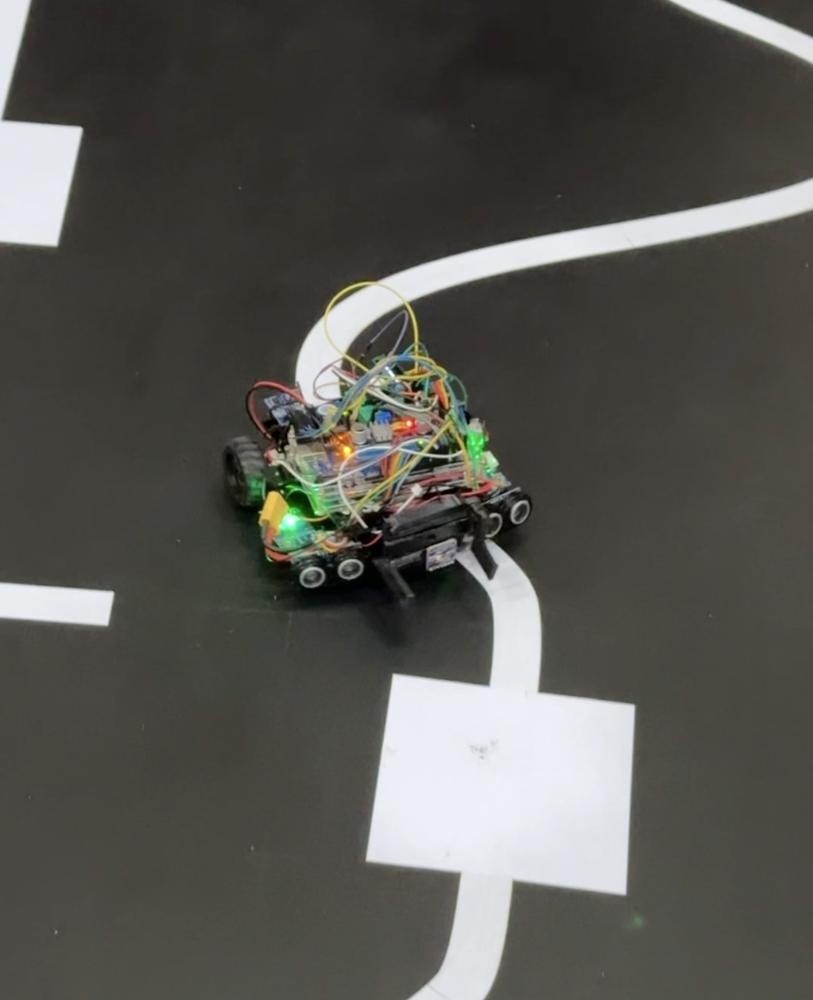

# Cosmo_Robot

<h1>Cosmo Robot Project</h1>

  
This project is based on Arduino Mega 2560 and was developed for the Semester 3 Robot competition under the EN2533 - Robot Design and Competition module. The Cosmo robot is designed to showcase various capabilities, including precise line following, wall avoidance during line following, navigating ramps at 20-30 degrees, interacting with objects using a mechanical arm, sound sensitivity, color detection, and maze-solving capabilities. Additionally, it can avoid obstacles, such as a guard robot, on its way to the final destination.

  <h2>Features</h2>

  <ul>
      <li>Precise Line Following</li>
      <li>Wall Avoidance during Line Following</li>
      <li>Ramp Navigation (20-30 degrees)</li>
      <li>Mechanical Arm for Object Interaction</li>
      <li>Sound Sensitivity</li>
      <li>Color Detection</li>
      <li>Maze Solving Capabilities</li>
      <li>Obstacle Avoidance (Guard Robot)</li>
  </ul>

  <h2>Components Used</h2>

  <ul>
      <li>Arduino Mega 2560</li>
      <!-- Add other components here -->
  </ul>

  <h2>Instructions</h2>

  
Provide instructions on how to set up and run the Cosmo robot. Include any dependencies, libraries, or special configurations required for the project.

  <h2>Contributing</h2>

  
Feel free to contribute to the project by submitting bug reports, feature requests, or pull requests. Your contributions are highly appreciated!

